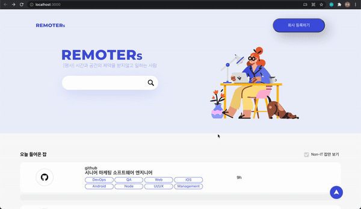

# Remoters

> 2021년 6월 19일 ~ 6월 21일<br>
> Front-end 직무 기술 과제 제출용 repository

## 🖇️ Contents
- [Remoters](#remoters)
  - [🖇️ Contents](#️-contents)
  - [Stack](#stack)
  - [Features](#features)
    - [1. Routing](#1-routing)
    - [2. API](#2-api)
    - [3. Fixed button](#3-fixed-button)
    - [4. Interactive web](#4-interactive-web)
    - [5. Future work](#5-future-work)

<h3 align='center'>Preview</h3>
<p align='center'>
  
</p>

## Stack
<p>
  
  
  
</p>

## Features

### 1. Routing
  * `react-router-dom`를 활용한 페이지 이동 기능
   * / : Home 페이지 경로
   * /company : 회사 등록하기 버튼 클릭 시 Company 페이지 경로 이동
   ```typescript
   <div className="App">
     <Route exact path='/' component={Home}/>
     <Route path='/company' component={Company} />
   </div>
   ```

### 2. API 
  * `fetch` 메소드를 통한 API 호출
  ```typescript
    useEffect(() => {
            if(todayJobs.length === 0) {
                getJobs();
            }
        })

    const getJobs = async () => {
        try {
            const res = await fetch('api_url')
                              .then(response => response.json())
            setTodayJobs(res.todayJobs)
            setWeeklyJobs(res.weeklyJobs)
            setIsLodaing(false)
        } catch (error) {
            // error handling
        }
    }
  ```
  * 직업 정보에 해당되는 값을 최초 렌더링 시 API로부터 받아 화면에 표시
  * 호출한 API 값을 `res` 변수에 할당 후 `state`에 저장
  * `useEffect`를 통해 컴포넌트 렌더링 시 해당정보를 가져옴

### 3. Fixed button
  * 우측 하단에 고정된 버튼
  ```css
  position: fixed;
  z-index: 9999;
  ```
  * 클릭 시 페이지 최상단으로 이동
  ```typescript
  onClick = {() => {
    window.scrollTo({
      top: 0,
      left: 0,
      behavoir: 'smooth'
    })
  }}
  ```

### 4. Interactive web
  * 직업 카드 클릭 시 숨겨져 있는 정보 표시(애니메이션 적용)
  * 다시 클릭 시 정보 숨기기

### 5. Future work
  * 정보 숨길 때 접히는 애니메이션이 적용
  * 반응형 웹 미구현
