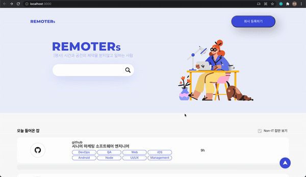

# Remoters

2021년 6월 19일 ~ 6월 21일, Y회사 Front-end 개발자 기술 과제

<h3 align='center'>Preview</h3>

  

<h3 align='center'>Technical specs</h3>

  
  

## Features

1. Router를 활용한 페이지 이동
2. fetch를 활용한 API 호출
3. Floating button을 활용한 위로가기 버튼
4. 디자인된 체크박스
5. 호출된 API 데이터를 기반으로 렌더링된 직업 카드
6. 직업 카드 클릭 시 펼쳐지는 애니메이션 효과 적용
